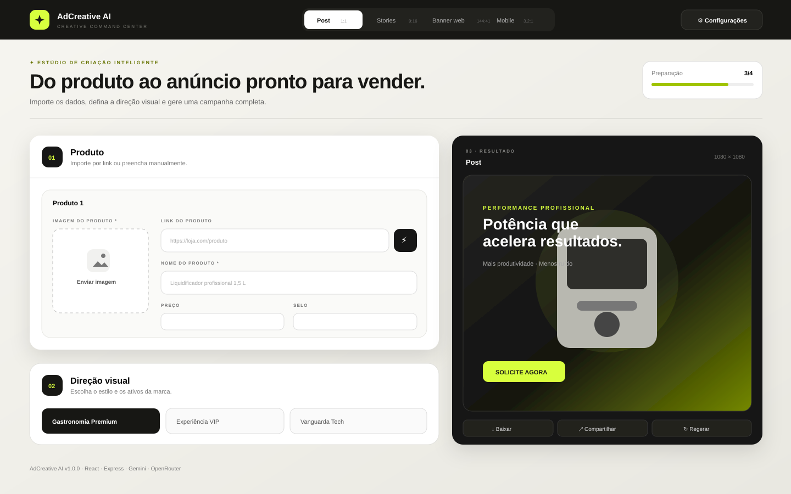

<div align="center">

# AdCreative AI

### Transforme fotos e dados de produtos em campanhas publicitárias prontas para vender.

[](https://github.com/Ronickbr/ADcreativo_IG/releases)
[](https://react.dev/)
[](https://www.typescriptlang.org/)
[](#licença)

</div>



> A imagem acima é uma prévia vetorial fiel à interface da versão 1.0.0.

## Sobre o projeto

O **AdCreative AI** é um estúdio de criação multimodal para gerar anúncios a partir da imagem, do link e das informações técnicas de um produto. A aplicação cria a estratégia de copy, os benefícios, a chamada para ação, a legenda, as hashtags e a composição visual final.

O fluxo foi pensado para e-commerce, varejo e equipes de marketing que precisam produzir peças rapidamente sem perder a identidade do produto.

## Principais recursos

- Importação automática de título, descrição e imagem por URL.
- Upload manual de produto, cenário e logotipo.
- Preservação explícita das características visuais do produto no prompt.
- Formatos para Instagram, Stories/Reels, banner web e banner mobile.
- Estilos Gastronomia Premium, Experiência VIP e Vanguarda Tech.
- Preços e selos de promoção, parcelamento ou pagamento à vista.
- Copy completa com headline, benefícios, CTA, legenda e hashtags.
- Download, compartilhamento e regeneração do criativo.
- Integração com Google Gemini e OpenRouter.
- Interface responsiva para desktop e dispositivos móveis.

## Arquitetura

| Camada | Tecnologias | Responsabilidade |
|---|---|---|
| Interface | React 19, TypeScript, Tailwind CSS 4, Motion | Formulário, direção visual, prévia e resultados |
| Backend | Node.js, Express | API, segurança, scraping e integração com IA |
| Inteligência artificial | Google GenAI, OpenRouter | Estratégia, copy e geração de imagem |
| Extração | Cheerio | Leitura de metadados de páginas de produto |
| Qualidade | TypeScript, Node Test Runner | Tipagem, testes e build |

### Estrutura principal

```text
.
├── docs/
│   └── app-preview.svg
├── src/
│   ├── lib/
│   │   ├── api.ts
│   │   └── urlSafety.ts
│   ├── App.tsx
│   ├── index.css
│   └── main.tsx
├── tests/
│   ├── api.test.ts
│   └── urlSafety.test.ts
├── server.ts
├── CHANGELOG.md
└── implementation_plan.md
```

## Requisitos

- Node.js 20 ou superior.
- npm 10 ou superior.
- Uma chave do Google Gemini ou OpenRouter.

## Instalação

```bash
git clone https://github.com/Ronickbr/ADcreativo_IG.git
cd ADcreativo_IG
npm install
cp .env.example .env
```

Configure pelo menos um provedor no arquivo `.env`:

```env
GEMINI_API_KEY=
OPENROUTER_API_KEY=
OPENROUTER_MODEL=google/gemini-2.5-flash-image
PORT=3000
```

Inicie o ambiente de desenvolvimento:

```bash
npm run dev
```

Acesse `http://localhost:3000`.

## Comandos

| Comando | Descrição |
|---|---|
| `npm run dev` | Inicia Express e Vite em modo de desenvolvimento |
| `npm run lint` | Verifica os tipos sem gerar arquivos |
| `npm run test` | Executa os testes automatizados |
| `npm run build` | Gera o bundle de produção |
| `npm run check` | Executa lint, testes e build |
| `npm run preview` | Abre a prévia do bundle |

## API

| Método | Rota | Finalidade |
|---|---|---|
| `GET` | `/api/health` | Verificação de saúde do servidor |
| `GET` | `/api/settings` | Informa quais provedores estão configurados |
| `POST` | `/api/scrape` | Importa dados públicos de uma página de produto |
| `GET` | `/api/proxy-image` | Obtém uma imagem pública com validação |
| `POST` | `/api/ai/generate` | Gera copy ou imagem pelo provedor escolhido |

## Segurança

- Chaves do servidor não são enviadas ao navegador.
- Chaves inseridas pela interface ficam apenas em `sessionStorage`.
- URLs locais, privadas e com protocolos inseguros são bloqueadas.
- Redirecionamentos são revalidados para impedir SSRF indireto.
- Downloads possuem timeout e limites de tamanho.
- A API aplica limite básico de requisições e headers de segurança.
- Erros internos não são expostos diretamente ao cliente.

Nunca envie arquivos `.env`, tokens ou chaves de API para o GitHub. Caso uma chave seja exposta, revogue-a imediatamente no provedor.

## Testes

```bash
npm run check
```

A versão 1.0.0 possui testes para:

- Parsing de respostas JSON puras e cercadas por Markdown.
- Mensagens amigáveis para respostas inválidas.
- Bloqueio de faixas IPv4 e IPv6 privadas ou reservadas.
- Liberação de endereços IPv4 públicos.

## Versionamento

O projeto segue [Versionamento Semântico](https://semver.org/lang/pt-BR/):

- **MAJOR**: alterações incompatíveis.
- **MINOR**: novas funcionalidades compatíveis.
- **PATCH**: correções compatíveis.

Consulte o [CHANGELOG.md](CHANGELOG.md) para o histórico.

## Roadmap

As próximas melhorias são acompanhadas nas [Issues](https://github.com/Ronickbr/ADcreativo_IG/issues).

## Contribuição

1. Crie um fork ou uma branch a partir da `main`.
2. Faça alterações pequenas e objetivas.
3. Execute `npm run check`.
4. Use commits descritivos.
5. Abra um pull request explicando contexto, mudanças e validações.

## Licença

Distribuído sob a licença Apache 2.0. Consulte o arquivo `LICENSE` para mais informações.

---

<div align="center">
Desenvolvido para transformar informações técnicas em campanhas visuais de alto impacto.
</div>
